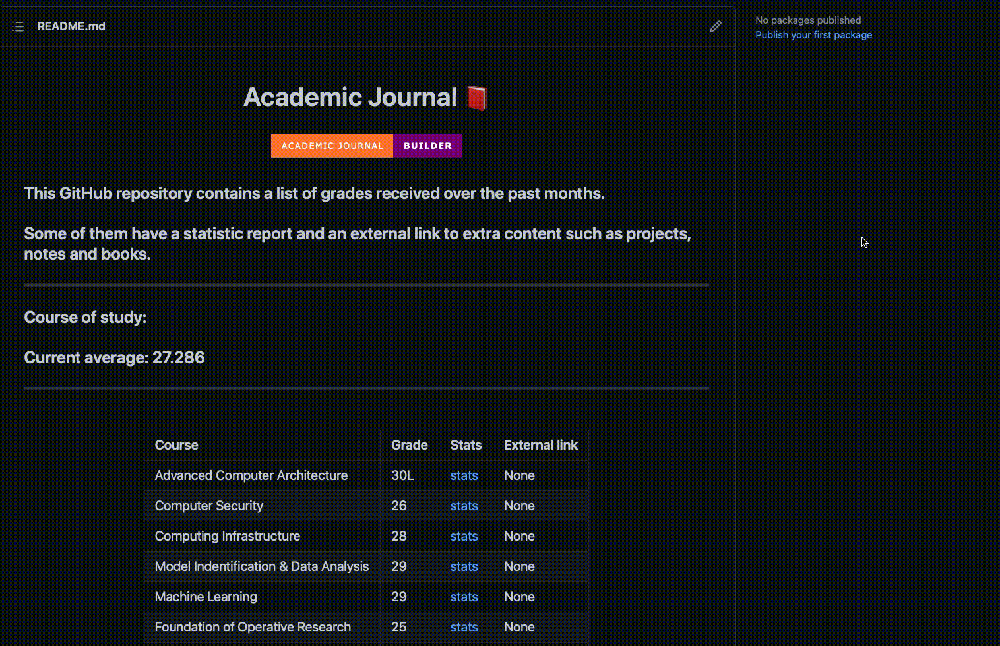

# Academic Journal Builder📕 &nbsp; 

### This simple command line tool allows to automate the whole process of grade journaling, managing a Github repository to store and document your academic journey.

# What you need
- A github repository to store your Academic Journal
- A valid SSH key for your GitHub account
- Python 3

# Installation

In order to install the Academic Journal Builder, just clone the repository and execute the install.sh file.

`cd <path_to_cloned_repo> && ./install.sh`

# Usage

1. Enter your repository link and matricola through the flags `--repo` and `--code`

2. [Optional] Add you course of study using the flag `--course-of-study`

3. That's it! Just add your first grade. You can either:

Add only the grade specifying the numeric value of the grade and the course name with the flags `--name` and `--grade`

Add a grade file and the course name with the flags a `--name` and `--path`. This way a CourseNameStats.md file with the exam statistics will be created

# How to format the grade file

The expected txt file is in the form

Matricola | Grade | ... | ... |
:--- | :--- | :--- | :--- |

With each colon divided by a tab `\t`

# How to obtain the grade file

Just go to Servizi Online > Consultazione Esito Esami, click on the grade you want to register, access the grade list and copy-paste it on a file.txt
